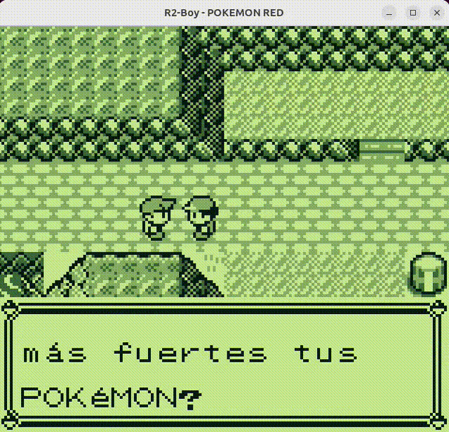
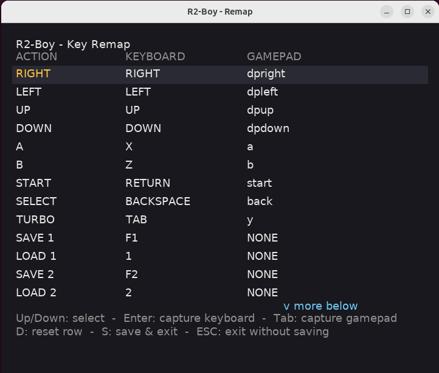
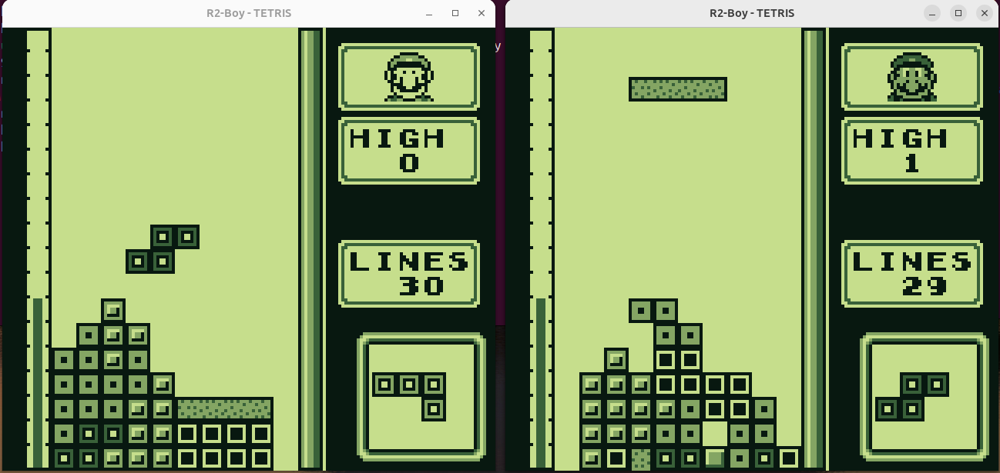
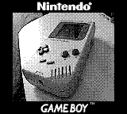

# R2-Boy - DMG Emulator




A Nintendo Game Boy (DMG-01) emulator written in C for educational purposes focusing on learning how the original hardware works.

---

## Features

### Emulation

- DMG (Original Game Boy) emulation
- CPU M-Cycle accurate instruction emulation
- HALT bug
- Memory bus emulation
- OAM bug
- Timer emulation
- Serial emulation
- PPU (Pixel Processing Unit) emulation
- APU (Audio Processing Unit) emulation
- OAM DMA emulation
- Game Boy Printer emulation

### Cartridge

- Cartridge loading. Supported mappings:
  - MBC1
  - MBC2
  - MBC3 + RTC
  - MBC5 + rumble
  - MBC6
  - MBC7 + accelerometer
  - MMM01
  - M161
  - HuC1
  - HuC-3
  - Camera

- Save game support with autosave on a background thread, so you don't lose your mewtwo even if you shut down the computer

### Frontend

- SDL-based graphics output
- Keyboard and Gamepad input support
- Testing support (headless debug mode for mooneye/Blargg ROMs)
- Link Cable support over TCP/IP
- Frontend UX:
  - Game title shown in the window title (`R2-Boy - <title>`)
  - Key remapping (`--remap` interactive prompt; persisted to `~/.config/r2boy/config.ini`)
  - Volume / mute control (runtime hotkeys + `--volume`/`--mute` flags)
  - Turbo / fast-forward (hold `Tab`; audio is muted while active)
  - Alternative color palettes (`--palette`, hotkey `P` to cycle)
  - Snapshot the current image on the screen and save on a file
- 2 Save State slots: save or load the Game Boy state just pressing a key
- Game Boy Printer support. It saves the printed image on a file.
- Game Boy Camera support. It uses the computer's webcam, supporting YUYV and JPEG inputs.

---

## Current Status

R2-Boy works correctly and runs every DMG compatible game I tested.

This project is under active development.

Planned:
- CGB (Game Boy Color) support (more in the future)

---

## Quick Start

### Requirements

- GCC
- Make
- SDL2
- SDL2_ttf

### Compile

Install dependencies (On Ubuntu/Debian like systems):

```bash
sudo apt install build-essential libsdl2-dev libsdl2-ttf-dev
```

Create the build directory:
```bash
mkdir build
```

Build the emulator:

```bash
make
```

The executable will be generated in:

```bash
./build/r2boy
```

### Usage

Run a Game Boy ROM:

```bash
./build/r2boy [OPTIONS] rom.gb
```

Common options:

| Flag | Purpose |
| :--- | :--- |
| `-d`, `--debug`              | Headless mode; verify CPU registers (test ROMs) |
| `-b`, `--bios <file>`        | Use a specific Game Boy boot ROM (default `roms/bios.bin`) |
| `--volume <0..100>`          | Set the audio output volume |
| `--mute`                     | Start with audio muted |
| `--palette <NAME>`           | Use a built-in palette: `DMG`, `pocket`, `BGB`, `choco`, `pocket_green` |
| `--remap`                    | Open the visual key-remap window and exit (saves on `S`, aborts on `ESC`/close) |
| `--link-host <PORT>`         | Host a Game Link session on the given TCP port |
| `--link-connect <IP>:<PORT>` | Connect to a Game Link host |
| `--printer`                  | Use the Game Boy Printer and save the printed images on a file |
| `-h`, `--help`               | Show help and exit |
| `-v`, `--version`            | Show version and exit |

---

## Controls

Default keyboard mapping (rebindable, see [Configuration](#configuration)):

### Keyboard

| Key | Action |
| :---: | :---: |
| Arrow keys | D-Pad |
| X | A |
| Z | B |
| Enter | Start |
| Backspace | Select |

### Runtime controls

| Key | Action |
| :---: | :---: |
| Tab | Turbo (hold) |
| M | Mute toggle |
| 0 | Volume up |
| 9 | Volume down |
| P | Cycle color palette |
| F12 | Take snapshot |

### Gamepad

Gamepads are auto-detected via SDL GameController. The D-Pad, face buttons, Start/Back and analog stick map to the joypad by default; all gamepad buttons are also rebindable in the remap window.

Rumble carts (`MBC5` with rumble) drive the controller's haptic. 

For MBC7 cartridges with an accelerometer, R2-Boy uses the controller's accelerometer when available. If no accelerometer is present, the right analog stick or WASD keys can be used to simulate accelerometer input. These controls are also configurable through the remapping interface.

---

## Palettes

R2-Boy ships six built-in DMG color palettes. The default reproduces the warm greenish tint of the original DMG LCD; the others mimic the Game Boy Pocket, the BGB emulator, a "chocolate" tint, and a cooler green pocket variant. Switch at startup with `--palette <NAME>` or at runtime by pressing `P` (the current palette is printed to stderr). The choice is persisted across runs in the config file.

| Name | Style |
| :--- | :--- |
| `DMG`           | Classic DMG (default) |
| `pocket`        | Game Boy Pocket monochrome |
| `BGB`           | BGB emulator palette |
| `choco`         | Warm brown tint |
| `pocket_green`  | Cool green pocket-like |
| `basic`         | Pure white, black and grey |

---

## Configuration

R2-Boy keeps its config in `~/.config/r2boy/config.ini` (or `$XDG_CONFIG_HOME/r2boy/config.ini` if set). Four sections are written. It includes keyboard and gamepad mappings, volume control and palette.

Keyboard bindings support modifier chords written as `Ctrl+Shift+X` style tokens. Any combination of the prefixes `Ctrl`, `Shift`, `Alt`, `GUI` (also accepted: `Control`, `Option`, `Cmd`, `Super`, `Meta`) may precede a scancode name. A bare token like `X` parses as `mods=0` (matches any modifier state, the legacy behaviour). The special value `NONE` (or `—`) means no binding for that action.



The `--remap` flag opens a **visual SDL window** with a list of all 21 actions and their current keyboard + gamepad bindings. Keyboard keys are captured via SDL `SDL_KEYDOWN` (so layout-independent scancodes and modifier chords work); gamepad buttons are captured via `SDL_CONTROLLERBUTTONDOWN`.

```bash
./build/r2boy --remap
```

In the remap window:

| Key | Action |
| :---: | :--- |
| Up / Down | Select row |
| Enter | Capture keyboard binding for selected row |
| Tab | Capture gamepad binding for selected row |
| D | Reset selected row to default |
| S | Save and exit |
| ESC | Exit without saving |
| Window close | Exit without saving |

Runtime hotkey changes (volume, mute, palette) are written back to `config.ini` when the emulator exits, so the next launch picks them up.

---

## Save Games & Autosave

Battery-backed cartridges write their SRAM and RTC state to `<rom>.sav` next to the ROM, the same layout other DMG emulators use.

Saves run on a **dedicated background thread**:

- The emulator thread sets `save_needed = 1` on every SRAM/RTC write and requests a save roughly every 5 seconds of in-game time (`AUTOSAVE_RATE_FRAMES`).
- A saver thread snapshots the SRAM and RTC under a short `pthread_mutex` critical section, then `fwrite`s the snapshot outside the lock so disk I/O never blocks emulation.
- The save file is written to `<rom>.tmp` first, `fflush`ed, `fclose`d, then atomically `rename`d over `<rom>.sav` — a crash or power loss mid-write never corrupts the previous save.
- A battery-less cart (MBC0, ROM only) skips starting the saver thread entirely.
- On shutdown, the saver thread is `pthread_join`ed and `cleanup_core` performs one final synchronous flush as a safety net.

Save games are interchangeable with other DMG emulators that follow the standard `.sav` layout.

---

## Save States

R2-Boy provides two save state slots:

- `F1` — Save State 1
- `1` — Load State 1
- `F2` — Save State 2
- `2` — Load State 2

These keys are also rebindable and persisted at `config.ini`.

Save states are separate from battery-backed cartridge saves.

---

## BIOS

R2-Boy supports the Game Boy boot ROM, just use the option:

```bash
./build/r2boy --bios <biosfile> game.gb
```

If you don't use the option, it will use the default path "roms/bios.bin".

If no boot ROM is available, R2-Boy initializes the hardware registers to the same state produced by the original DMG boot ROM (DMG-ABC revision), allowing commercial games to start correctly.

---

## Debug Mode

For running tests like mooneye, use the option:

```bash
./build/r2boy -d test.gb
```

In debug mode, video output is disabled and the emulator automatically checks the register values used by Mooneye test ROMs to determine whether the test passed.

---

## Link Cable



R2-Boy includes Link Cable support over TCP/IP, allowing two emulator instances to communicate across the network.

### Host

```bash
./build/r2boy --link-host <PORT> game.gb
```

### Client
```bash
./build/r2boy --link-connect <IP>:<PORT> game.gb
```

### Example:

Host:

```bash
./build/r2boy --link-host 9999 tetris.gb
```

Client:

```bash
./build/r2boy --link-connect 192.168.1.25:9999 tetris.gb
```

Reconnection is supported; if the process terminates on either side, restarting it will re-establish the connection.

However, most games don't handle mid-game reconnection and will probably simply freeze.

---

## Game Boy Printer

R2-Boy supports Game Boy Printer emulation, allowing compatible games to print images directly from the emulator.

When enabled, the emulator receives the print data sent by the Game Boy and converts it into an image file on the host computer.

Enable Game Boy Printer support with:

```bash
./build/r2boy --printer game.gb
```

The printed images are saved automatically to files on the host system.

It can't be used at the same time that the Link Cable, in order to reproduce original behavior.

---

## Game Boy Camera



R2-Boy supports Game Boy Camera emulation using the computer's webcam as the camera input.

The emulator supports YUYV and JPEG webcam input formats.

This allows compatible Game Boy Camera software to capture images using a modern computer webcam while running inside R2-Boy.

The Game Boy Camera implementation is designed to reproduce the original camera interface while adapting the physical camera hardware to a modern webcam.

---

## Accuracy

The emulator aims to emulate the Game Boy hardware at the cycle level whenever possible.

R2-Boy currently passes:
- All Blargg's test ROMs
- All Mooneye tests ROMs
- dmg-acid2

It also fails the Blargg's CGB specific ROMs `cgb_sound` and `interrupt_time` exactly like a real DMG.

---

## License

MIT

---

## Project Structure

```
src/
├── apu/
|   └── apu.c/.h
├── bus/
|   └── bus.c/.h
├── cartucho/
|   ├── mbc/
|   ├── cartucho.c/.h
|   ├── savestate.c/.h
|   └── save.c/.h
├── cpu/
|   ├── opcodes/
|   └── cpu.c/.h
├── frontend/
|   ├── frontend.c/.h
|   ├── lcd.c/.h
|   ├── audio.c/.h
|   ├── config.c/.h
|   ├── remap_ui.c/.h
|   ├── gamepad.c/.h
|   ├── printer.c/.h
|   └── link.c/.h
├── ppu/
|   ├── ppu.c/.h
|   ├── bg_fetcher.c/.h
|   ├── sp_fetcher.c/.h
|   └── types.h
├── serial/
|   └── serial.c/.h
├── timer/
|   └── timer.c/.h
├── gb.c
├── gb.h
└── main.c
```

---
